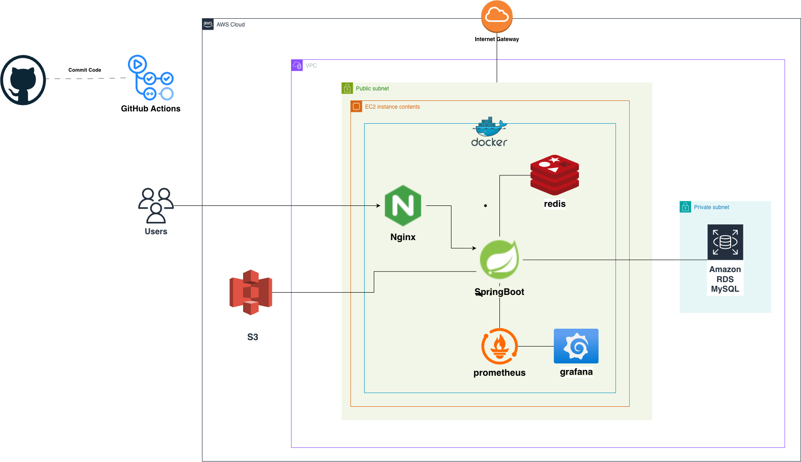

# 경매톡

> 경매 전문가와 사용자를 연결하는 경매 상담 및 매물 조회 서비스

## 프로젝트 소개
경매톡은 경매 전문가와 사용자를 연결하는 서비스로,  
경매 정보 탐색, 상담 신청, 매물 조회, 리뷰 확인 기능을 제공합니다.

## 담당 역할
- 백엔드 개발 전담
- 인증/인가 구현
- AWS 인프라 및 배포 환경 구성
- 모니터링 환경 구축

## 기술 스택
- Backend: Java, Spring Boot, Spring Security, JPA, QueryDSL
- DB: MySQL, Redis
- Infra: AWS EC2, RDS, S3, Docker, Nginx, GitHub Actions
- Monitoring: Prometheus, Grafana

## 시스템 아키텍처

## 주요 문제 해결
### 상담 예약 동시성 제어
- 동일 시간대 중복 예약이 발생할 수 있는 문제를 확인
- DB Unique Constraint와 Pessimistic Lock을 적용해 동시성 문제 해결

### 이미지 저장 구조 개선
- S3 Presigned URL 기반 업로드 구조 적용
- 애플리케이션 서버를 거치지 않도록 개선해 효율성과 보안성 향상

### 리뷰 알림 배치 안정화
- Spring Batch + FCM 기반 리뷰 알림 배치 구현
- Tasklet에서 Chunk 기반 구조로 전환해 일부 발송 실패가 전체 배치 중단으로 이어지지 않도록 개선

## 운영 개선
- GitHub Actions 기반 CI/CD 구축
- Prometheus, Grafana 기반 모니터링 환경 구축
- Redis를 활용한 캐시 및 토큰 관리 적용
